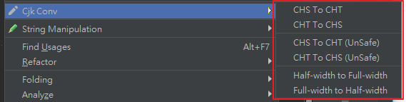

# idea-cjk-conv README

convert `chinese`／`hanzi` between `Shinjitai`／`Traditional`／`Simplified`
idea-cjk-conv 中文漢字 轉換 `新字体`／`繁體`／`简体`

## install

https://github.com/bluelovers/idea-cjk-conv

* [github](releases/idea-cjk-conv.jar)
* [jetbrains](https://plugins.jetbrains.com/plugin/11012-cjk-conv)

## Feature

> Feature already in this plugin

* convert Traditional / Simplified (safe / unsafe mode)
* convert full-width / half-width (need add more char support)

> 已實現功能

* 簡繁互轉 (分為 安全模式 與 危險模式)
* 全形 半形 轉換 (尚未完整支援所有這類字元)

## Roadmap

> but need help make it

* support Shinjitai
* support menu on search input field
* fork feature from [cjk-conv](https://github.com/bluelovers/cjk-convert)
* fork feature from [regexp-cjk](https://github.com/bluelovers/regexp-cjk)
* fully support convert full-width / half-width (full range)

> 以下功能 礙於 本人惰性與實際上不懂 kotlin / java 所以距離實現可能遙遙無期

* 支援日文漢字互轉 ([新字体](https://en.wikipedia.org/wiki/Shinjitai))
* 支援搜尋輸入框
* 將 [cjk-conv](https://github.com/bluelovers/cjk-convert) 的功能移植進來
* 將 [regexp-cjk](https://github.com/bluelovers/regexp-cjk) 的功能移植進來
* 支援 全形/半形 轉換 (完整字元範圍)

## Link

* [cjk-conv](https://github.com/bluelovers/cjk-convert)
* [regexp-cjk](https://github.com/bluelovers/regexp-cjk)
* [Run Configuration for TypeScript](https://github.com/bluelovers/idea-run-typescript)
* 

### this plugin copy some code from

* https://github.com/YiiGuxing/TranslationPlugin
* https://github.com/krasa/StringManipulation
* 

## Screenshot

